# 011 基于卷积神经的图像风格迁移-设计源码展示

> **代码有偿获取 可接受定制 微信联系方式: csbysj2020 或 ACE2487，备注(BS)**

> 

> 

## 技术栈

深度学习 pytorch tensorflow python vue 卷积神经 风格迁移 对抗网络

## 视频

> **点击查看 \>\>\> [https://www.bilibili.com/video/BV1xY411M7yq/](https://www.bilibili.com/video/BV1xY411M7yq/)**

## 截图

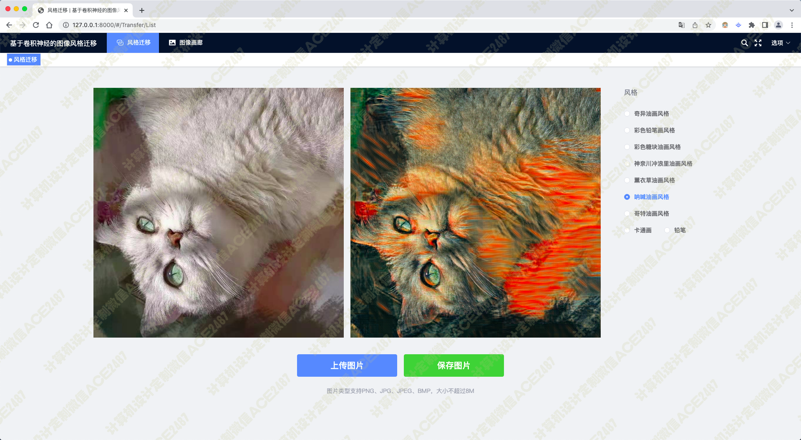
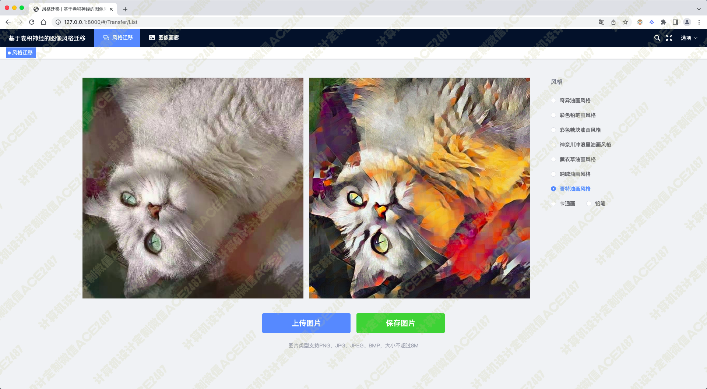
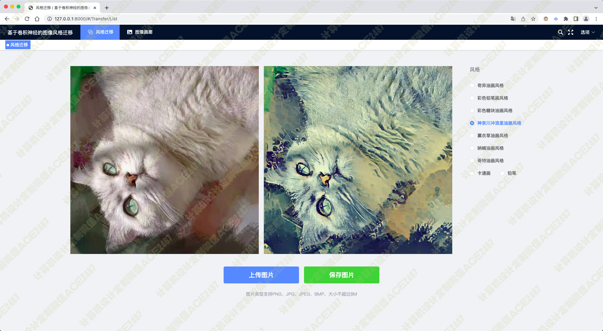
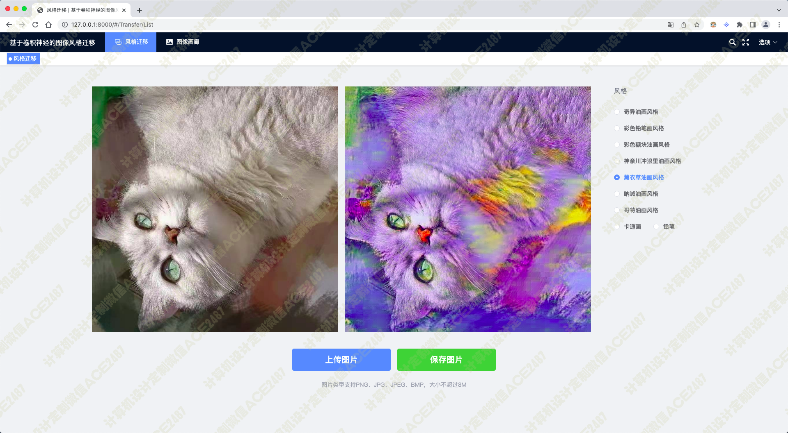
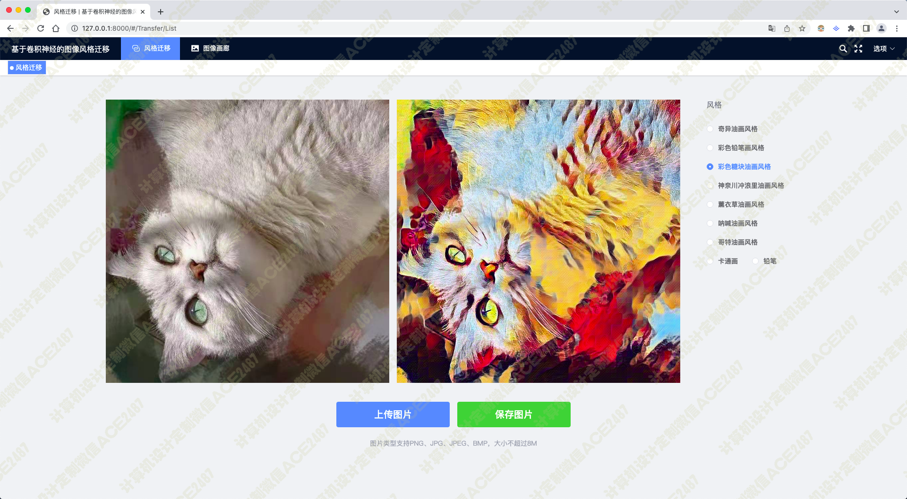
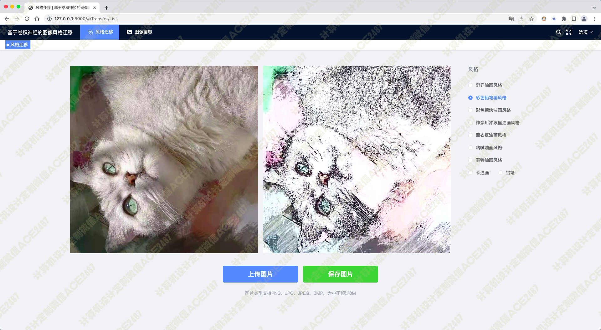
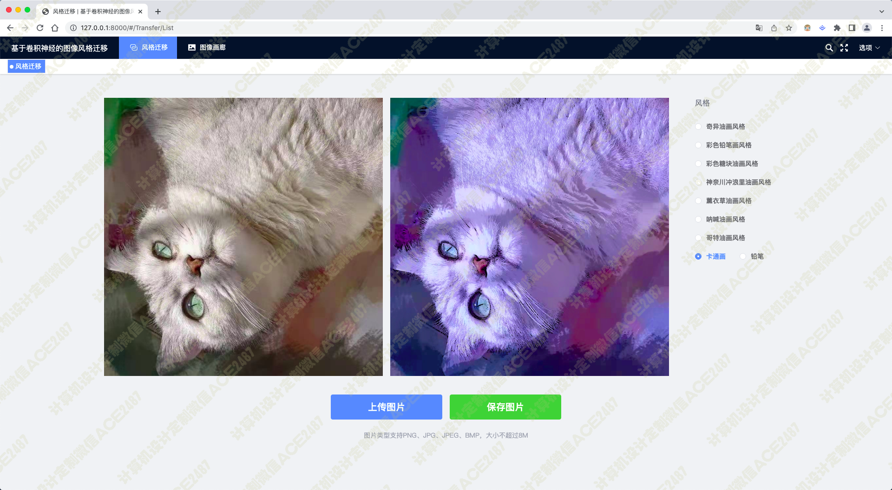
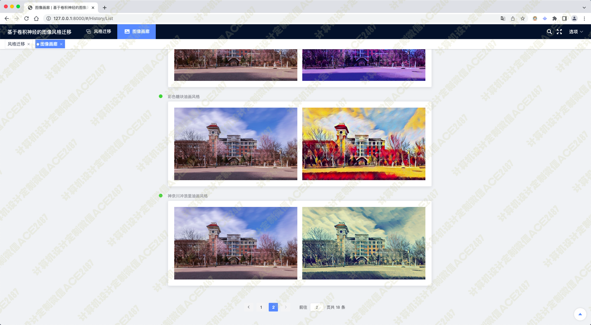
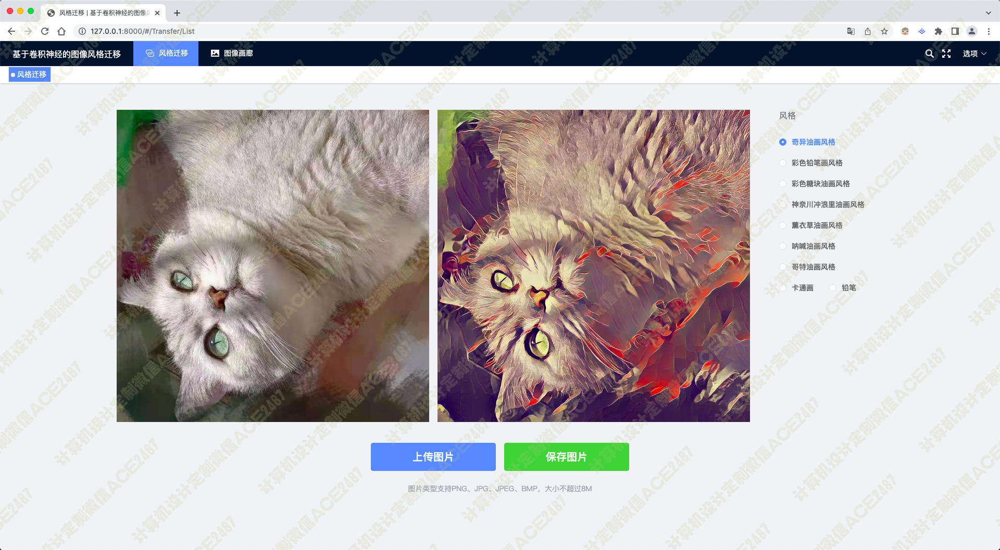
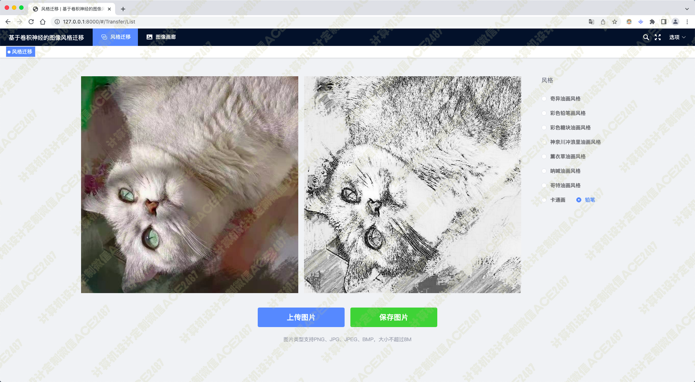
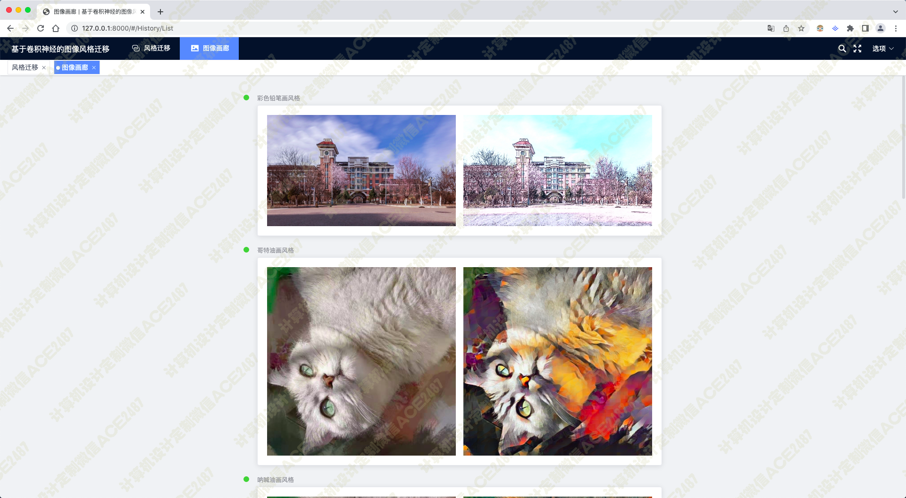